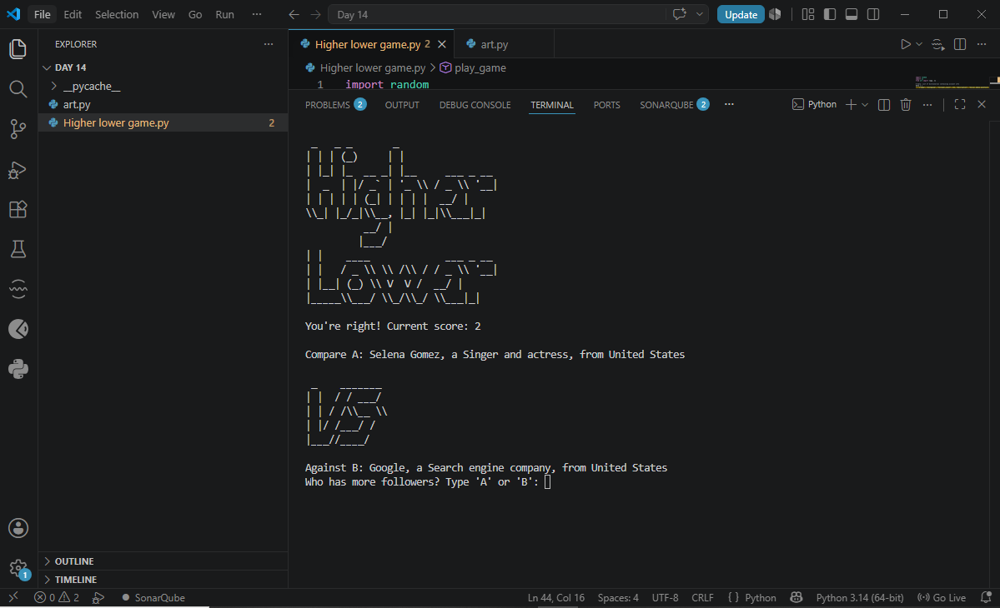

# Day 14 – Higher Lower Game

## 📌 Overview
Is session mein humne ek complete **Higher Lower Game** banaya jahan player ko do items (jaise celebrities, brands, ya kisi bhi category) dikhaye jate hain aur usse guess karna hota hai ke kaunsi item ki "value" (jaise followers count, popularity score, etc.) zyada hai. Ye project pichle sessions ke concepts — lists, dictionaries, randomization, functions, aur loops — ka combination tha, plus terminal ko visually behtar banane ke liye **ASCII art** bhi use ki.

---

## 1️⃣ Game Concept

- Do random items screen pe show hote hain (A aur B)
- Player guess karta hai ke kaunsi item ki value zyada hai
- Agar sahi guess ho — score +1 hota hai aur naya round shuru hota hai (jeetne wali item continue rehti hai, nayi random item aati hai)
- Agar galat guess ho — game over ho jata hai aur final score show hota hai

---

## 2️⃣ Concepts Used in This Project

| Concept | Kahan Use Hua |
|---------|----------------|
| List of Dictionaries | Har item (name, follower_count, description, country) ek dictionary, sab items ek list mein |
| Randomization | `random.choice()` se random items nikalna |
| Functions | Score tracking, comparison logic, game loop ko modules mein todna |
| While Loop | Game ko chalate rehna jab tak galat guess na ho |
| If-Else | Guess sahi hai ya galat check karna |
| String Formatting | Items ko readable tareeqe se show karna |
| ASCII Art / Multi-line Strings | Game ka visual look better banana |

---

## 3️⃣ Step 1: Data Setup (List of Dictionaries)

Har item ko dictionary ki soorat mein store karte hain, jisme uska naam aur "value" (jise compare karna hai) hota hai.

```python
a_data = {"name": "Instagram", "follower_count": 346, "description": "Social media platform", "country": "United States"}
b_data = {"name": "Google", "follower_count": 40, "description": "Search engine company", "country": "United States"}

data = [
    {"name": "Instagram", "follower_count": 346, "description": "Social media platform", "country": "United States"},
    {"name": "Google", "follower_count": 40, "description": "Search engine company", "country": "United States"},
    {"name": "PewDiePie", "follower_count": 111, "description": "YouTuber", "country": "Sweden"},
    {"name": "Cristiano Ronaldo", "follower_count": 215, "description": "Footballer", "country": "Portugal"},
    {"name": "Elon Musk", "follower_count": 128, "description": "Entrepreneur", "country": "United States"},
]
```

**Explanation:**
- Ye "list of dictionaries" pattern hai jo Day 9 mein nesting ke tor pe seekha tha
- Har dictionary mein `name`, `follower_count` (comparison ke liye value), `description`, aur `country` hai

---

## 4️⃣ Step 2: Random Item Choose Karna

```python
import random

def get_random_account():
    """Returns a random account dictionary from the data list."""
    return random.choice(data)
```

---

## 5️⃣ Step 3: Format Function (Item ko Readable Banana)

```python
def format_data(account):
    """Formats an account dictionary into a readable string."""
    name = account["name"]
    description = account["description"]
    country = account["country"]
    return f"{name}, a {description}, from {country}"
```

Isse hum har item ko is tarah dikha sakte hain:
```
Instagram, a Social media platform, from United States
```

---

## 6️⃣ Step 4: Compare Function (Kaunsi Item Bari Hai Check Karna)

```python
def check_answer(guess, a_follower_count, b_follower_count):
    """Checks whether the user's guess ('a' or 'b') is correct."""
    if a_follower_count > b_follower_count:
        return guess == "a"
    else:
        return guess == "b"
```

**Explanation:**
- Agar A ki follower count zyada hai, to sahi answer sirf `"a"` guess karna hoga
- Warna sahi answer `"b"` hoga
- Function `True`/`False` return karta hai jo bata deta hai ke guess sahi tha ya nahi

---

## 7️⃣ Step 5: Main Game Loop

```python
def play_game():
    print("Welcome to Higher Lower!")

    score = 0
    game_should_continue = True

    a_account = get_random_account()
    b_account = get_random_account()

    while game_should_continue:
        # Ensure A aur B alag hon
        while a_account == b_account:
            b_account = get_random_account()

        print(f"Compare A: {format_data(a_account)}")
        print("Versus")
        print(f"Against B: {format_data(b_account)}")

        guess = input("Who has more followers? Type 'A' or 'B': ").lower()

        a_follower_count = a_account["follower_count"]
        b_follower_count = b_account["follower_count"]

        is_correct = check_answer(guess, a_follower_count, b_follower_count)

        if is_correct:
            score += 1
            print(f"You're right! Current score: {score}")
            a_account = b_account
            b_account = get_random_account()
        else:
            game_should_continue = False
            print(f"Sorry, that's wrong. Final score: {score}")
```

**Explanation:**
- Loop shuru hone se pehle ensure karte hain ke `a_account` aur `b_account` alag items hon (ek hi item dono taraf na aa jaye)
- Har round mein user compare karta hai aur guess deta hai
- Agar sahi ho: score barhta hai, jeetne wali item (`b_account`) agli round ki `a_account` ban jati hai, aur nayi random `b_account` aati hai — is se game continuously naye comparisons deta rehta hai
- Agar galat ho: loop `game_should_continue = False` se ruk jata hai aur final score show hota hai

---

## 8️⃣ Step 6: ASCII Art (Optional Visual Enhancement)

Terminal games ko attractive banane ke liye multi-line string mein ASCII art use ki ja sakti hai:

```python
logo = """
 _   _眼_       _
| | | (_)      | |
| |_| |_  __ _| |__   ___ _ __ 
|  _  | |/ _` | '_ \\ / _ \\ '__|
| | | | | (_| | | | |  __/ |
\\_| |_/_|\\__, |_| |_|\\___|_|
          __/ |
         |___/  __
| |    _____      _____ _ __
| |   / _ \\ \\ /\\ / / _ \\ '__|
| |__| (_) \\ V  V /  __/ |
|_____\\___/ \\_/\\_/ \\___|_|
"""

vs = """
 _    _______
| |  / / ___/
| | / /\\__ \\ 
| |/ /___/ / 
|___//____/  
"""

print(logo)
```

*(Note: ASCII art ke sath backslash `\` escape characters ka khayal rakhna zaroori hai)*

---

## 9️⃣ Full Combined Program

```python
import random

data = [
    {"name": "Instagram", "follower_count": 346, "description": "Social media platform", "country": "United States"},
    {"name": "Google", "follower_count": 40, "description": "Search engine company", "country": "United States"},
    {"name": "PewDiePie", "follower_count": 111, "description": "YouTuber", "country": "Sweden"},
    {"name": "Cristiano Ronaldo", "follower_count": 215, "description": "Footballer", "country": "Portugal"},
    {"name": "Elon Musk", "follower_count": 128, "description": "Entrepreneur", "country": "United States"},
]


def get_random_account():
    """Returns a random account dictionary from the data list."""
    return random.choice(data)


def format_data(account):
    """Formats an account dictionary into a readable string."""
    return f"{account['name']}, a {account['description']}, from {account['country']}"


def check_answer(guess, a_follower_count, b_follower_count):
    """Checks whether the user's guess ('a' or 'b') is correct."""
    if a_follower_count > b_follower_count:
        return guess == "a"
    else:
        return guess == "b"


def play_game():
    print("Welcome to Higher Lower!")

    score = 0
    game_should_continue = True

    a_account = get_random_account()
    b_account = get_random_account()

    while game_should_continue:
        while a_account == b_account:
            b_account = get_random_account()

        print(f"Compare A: {format_data(a_account)}")
        print("Versus")
        print(f"Against B: {format_data(b_account)}")

        guess = input("Who has more followers? Type 'A' or 'B': ").lower()

        a_follower_count = a_account["follower_count"]
        b_follower_count = b_account["follower_count"]

        is_correct = check_answer(guess, a_follower_count, b_follower_count)

        if is_correct:
            score += 1
            print(f"You're right! Current score: {score}\n")
            a_account = b_account
            b_account = get_random_account()
        else:
            game_should_continue = False
            print(f"Sorry, that's wrong. Final score: {score}")


play_game()
```

---

## 🔟 Example Run

```
Welcome to Higher Lower!
Compare A: Instagram, a Social media platform, from United States
Versus
Against B: PewDiePie, a YouTuber, from Sweden
Who has more followers? Type 'A' or 'B': a
You're right! Current score: 1

Compare A: PewDiePie, a YouTuber, from Sweden
Versus
Against B: Elon Musk, an Entrepreneur, from United States
Who has more followers? Type 'A' or 'B': b
You're right! Current score: 2

Compare A: Elon Musk, an Entrepreneur, from United States
Versus
Against B: Google, a Search engine company, from United States
Who has more followers? Type 'A' or 'B': b
Sorry, that's wrong. Final score: 2
```

---

## 📸 Screenshot

Terminal output showing the game running in VS Code, with ASCII art and live score tracking:



---

## ✅ Key Takeaways
- List of dictionaries real-world data (jaise multiple accounts/items with attributes) store karne ka natural tareeqa hai
- `random.choice()` se list mein se items pick karna aasan hai, lekin duplicate avoid karne ka logic khud likhna parta hai
- Comparison logic ko alag function (`check_answer`) mein rakhna code ko clean rakhta hai
- Winning item ko agle round ki base banana ("carry forward" pattern) game ko continuously interesting banata hai
- ASCII art terminal-based games ko visually engaging bana sakti hai
- Ye project dikhata hai ke chote chote functions mil kar ek pura interactive game bana sakte hain

---

## 🔗 Practice Task
- Data list mein apni khud ki 5 items add karo (jaise apne favorite games, movies, ya cricketers) apni khud ki comparison value ke sath
- High score tracking add karo jo session ke dauran best score yaad rakhe
- Game ko categories mein divide karo (Sports, Tech, Entertainment) aur user se category choose karwao
