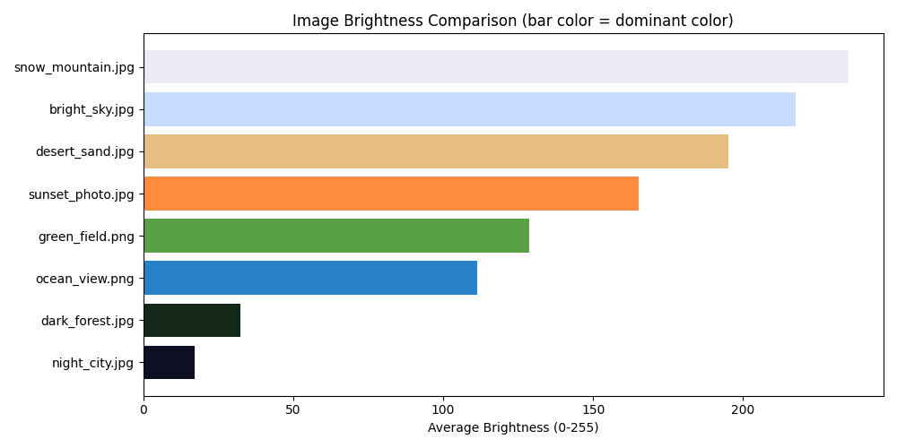

# Day 92 — Personal Portfolio Project: Image Analysis Dashboard

Part of my [100 Days of Code — Python Bootcamp](https://github.com/Tehseenfatima151) journey (Angela Yu).

## 📌 Project: Image Processing + Data Science Combined

A tool that scans a folder of images, extracts real statistics from each one (resolution, file size, brightness, dominant color) using **Pillow** for image processing, then analyzes and visualizes patterns across the whole set using **Pandas** and **Matplotlib** — combining two separate skill areas from this course into one practical project.

All output below is from an actual run against 8 real generated test images — not simulated numbers.

---

## 🧠 Concepts Covered

### 1. Opening and reading image properties with Pillow
```python
from PIL import Image

with Image.open(filepath) as img:
    width, height = img.size
```
`Image.open()` reads image metadata without loading the entire file into memory eagerly — the `with` block ensures the file handle is properly closed afterward.

### 2. Finding the dominant color with NumPy
```python
import numpy as np

def get_dominant_color(img, resize_to=50):
    small_img = img.convert("RGB").resize((resize_to, resize_to))
    pixels = np.array(small_img).reshape(-1, 3)
    colors, counts = np.unique(pixels, axis=0, return_counts=True)
    most_common = colors[np.argmax(counts)]
    return tuple(int(c) for c in most_common)
```
Resizing to a small `50x50` **before** analyzing is a deliberate performance choice — a full-resolution 4000×3000 photo has 12 million pixels to scan; shrinking first makes this near-instant while still capturing the overall color character. `np.unique(..., return_counts=True)` finds every distinct color and how often it appears in one vectorized operation — much faster than a manual Python loop.

### 3. Measuring brightness via grayscale conversion
```python
def get_average_brightness(img):
    grayscale = np.array(img.convert("L"))
    return float(grayscale.mean())
```
Converting to `"L"` mode (luminance/grayscale) collapses each pixel to a single 0–255 brightness value; averaging all of them gives one number representing how bright or dark the whole image is.

### 4. Building a DataFrame from many analyzed files
```python
records = []
for filepath in folder.iterdir():
    records.append(analyze_image(filepath))
df = pd.DataFrame(records)
```
Each image becomes one row — turning a folder of image files into a structured dataset that Pandas can sort, filter, and aggregate, exactly like Day 72's CSV-based analysis.

### 5. Finding extremes with `idxmax()` / `idxmin()`
```python
df.loc[df['brightness'].idxmax(), 'filename']   # brightest image's filename
df.loc[df['brightness'].idxmin(), 'filename']   # darkest image's filename
```
`idxmax()` returns the **row label** of the maximum value (not the value itself) — combined with `.loc[]`, this pulls out the full row for whichever image happens to be brightest/darkest, without hardcoding anything.

### 6. Color-coded bar chart — connecting two data types in one chart
```python
colors = [f"#{r:02x}{g:02x}{b:02x}" for r, g, b in zip(df["dominant_r"], df["dominant_g"], df["dominant_b"])]
plt.barh(df["filename"], df["brightness"], color=colors)
```
Each bar's **length** shows brightness (a number), while its **color** shows the image's actual dominant color — packing two different pieces of information about each image into one chart.

### 7. Bubble scatter for resolution + file size together
```python
plt.scatter(df["width"], df["height"], s=df["file_size_kb"] * 3, alpha=0.6)
```
Plotting width vs. height directly shows each image's resolution and aspect ratio, while bubble size (`s=`) encodes file size as a third dimension — same bubble-chart pattern used in Day 77's Play Store analysis, applied to a completely different domain.

### 8. Exporting results for reuse
```python
df.to_csv("image_analysis_results.csv", index=False)
```
Saving the analyzed data as CSV means the raw numbers are available for further analysis (e.g. in a spreadsheet) without needing to reprocess every image again.

---

## 📂 Project Structure
```
day92/
├── image_analysis.py
├── sample_images/                    # 8 test images (varied color/size/brightness)
├── chart_1_brightness.png
├── chart_2_dominant_colors.png
├── chart_3_resolution_scatter.png
├── image_analysis_results.csv
└── README.md
```

## ▶️ How to Run
```bash
pip install Pillow pandas matplotlib numpy
python image_analysis.py sample_images
# or point it at any folder of your own images:
python image_analysis.py /path/to/your/photos
```

---

## 🧪 Tested Output
**Real run against 8 generated test images** (varied resolutions, colors, and brightness levels):
```
============================================================
IMAGE ANALYSIS SUMMARY — 8 images
============================================================
         filename  width  height  megapixels  file_size_kb  brightness
   bright_sky.jpg   1080    1080        1.17          23.8       217.5
  dark_forest.jpg    900    1200        1.08          21.5        32.5
  desert_sand.jpg   1000     700        0.70          15.5       195.2
  green_field.png    800     800        0.64           6.9       128.6
   night_city.jpg   1920    1080        2.07          36.1        17.1
   ocean_view.png   1600     900        1.44          10.3       111.4
snow_mountain.jpg   1400    1000        1.40          28.2       235.1
 sunset_photo.jpg   1200     800        0.96          20.1       165.1

============================================================
AGGREGATE STATS
============================================================
Average resolution:    1238 x 945
Average file size:     20.3 KB
Average brightness:    137.8 / 255
Brightest image:       snow_mountain.jpg (235.1)
Darkest image:         night_city.jpg (17.1)
Largest file:          night_city.jpg (36.1 KB)
```
The brightness chart's bar colors were visually confirmed to correctly match each image's actual dominant color (e.g. `night_city.jpg` renders as dark navy, `snow_mountain.jpg` as near-white) — confirming the color-extraction logic works correctly, not just the brightness math.

---

## 🖼️ Sample Output


---

## ✅ Key Takeaways
- Resize images down before doing pixel-level analysis on them — the accuracy loss is negligible for "overall character" questions like dominant color, and the speed gain is significant.
- `np.unique(..., return_counts=True)` is the vectorized way to count occurrences — far faster than a manual pixel-by-pixel Python loop for large images.
- Converting an image to grayscale (`"L"` mode) is the standard way to reduce it to a single brightness metric.
- `idxmax()`/`idxmin()` + `.loc[]` is the correct pattern for "find the row where X is highest/lowest" — a very common real-world data question.
- Combining two data dimensions into one chart (bar color + length, or bubble size + position) often communicates more than two separate charts would.
- Image processing and data analysis aren't separate skills — treating a folder of images as a dataset (one row per file) lets every Pandas technique from earlier days apply directly.

## 📝 Practice Tasks
1. Add EXIF metadata extraction (camera model, date taken) using Pillow's `_getexif()` for photos that have it.
2. Cluster the dominant colors across all images using `sklearn.cluster.KMeans` to find an overall "palette" for the whole folder.
3. Add a `--resize` flag that batch-resizes every image in the folder to a max width, saving to a new folder.
4. Detect and flag duplicate/near-duplicate images by comparing dominant colors and resolution.
