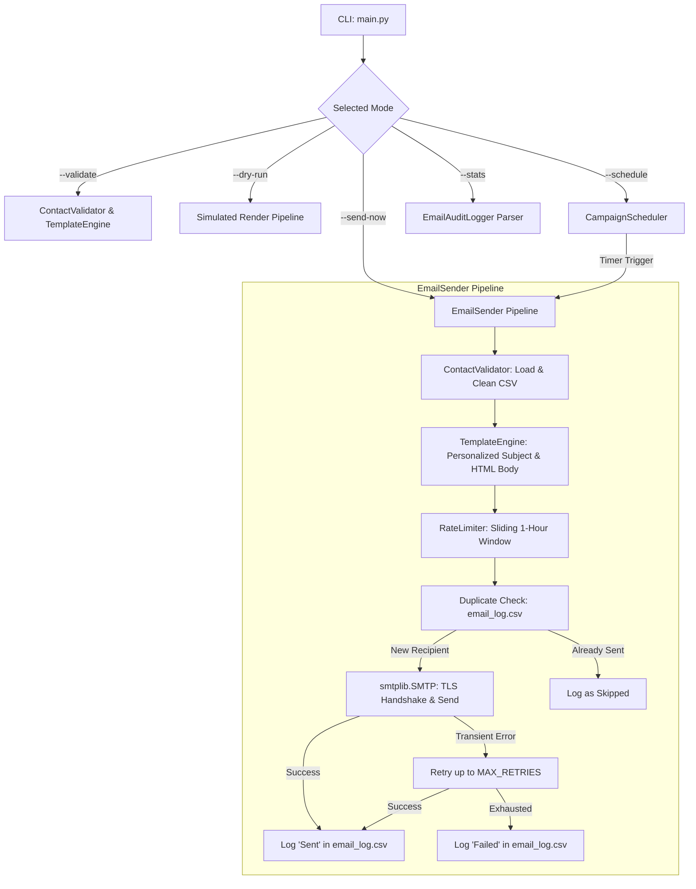

# Automated Bulk Email Campaign Manager

A production-grade, modular Python automation system built for marketing agencies and growth teams to manage, personalize, rate-limit, schedule, and deliver bulk HTML email campaigns safely via Gmail SMTP.

---

## Table of Contents

- [Overview](#overview)
- [Key Features](#key-features)
- [Technology Stack](#technology-stack)
- [Folder Structure](#folder-structure)
- [System Architecture](#system-architecture)
- [Installation & Setup](#installation--setup)
- [Gmail App Password Configuration](#gmail-app-password-configuration)
- [Environment Variables (.env)](#environment-variables-env)
- [CSV Contact Management](#csv-contact-management)
- [HTML Template & Personalization](#html-template--personalization)
- [Usage & CLI Commands](#usage--cli-commands)
  - [1. Validate Campaign Assets](#1-validate-campaign-assets)
  - [2. Dry-Run Simulation](#2-dry-run-simulation)
  - [3. Immediate Dispatch](#3-immediate-dispatch)
  - [4. Scheduled Launch](#4-scheduled-launch)
  - [5. Deliverability Statistics](#5-deliverability-statistics)
- [Rate Limiting & Retry Mechanism](#rate-limiting--retry-mechanism)
- [Duplicate Prevention System](#duplicate-prevention-system)
- [Logging & Audit Trail](#logging--audit-trail)
- [Running Automated Tests](#running-automated-tests)
- [Security Considerations](#security-considerations)
- [Troubleshooting](#troubleshooting)
- [Future Enhancements](#future-enhancements)

---

## Overview

Sending marketing emails in bulk without proper controls often leads to blacklisting, rate-limit bans, duplicate recipient dispatches, and syntax failures. **Automated Bulk Email Campaign Manager** solves these issues with a clean, extensible, modular Python engine that:

- Validates contacts against RFC standards before initiating any network calls.
- Enforces strict hourly rate-limiting with sliding-window pacing.
- Tracks historical dispatches in a structured CSV audit log to prevent duplicate emails for any given campaign.
- Renders responsive, personalized HTML emails with multipart plain-text fallbacks.
- Handles transient network or SMTP timeouts with configurable retry logic without crashing the batch.

---

## Key Features

- **Pandas CSV Ingestion**: High-performance contact loading with schema verification and whitespace normalization.
- **Robust Validation**: Detects malformed emails, empty fields, and in-file duplicate entries while skipping bad records safely.
- **Dynamic Personalization**: Replaces `{{name}}`, `{{company}}`, `{{offer}}`, `{{date}}`, and any custom CSV columns across both email subject and HTML body.
- **Gmail SMTP over TLS**: Secure, standards-compliant MIME email dispatch with zero hardcoded credentials.
- **Sliding-Window Rate Limiter**: Configurable hourly caps (e.g., 50 emails/hour) to maintain sender reputation and adhere to provider limits.
- **Fail-Safe Retries**: Automatic retry handling for transient connection drops with configurable attempt counts and backoff delays.
- **Campaign Scheduling**: Deferred campaign launches for specific calendar dates (`YYYY-MM-DD`) and times (`HH:MM`) using the `schedule` library.
- **Comprehensive Logging**: Separate machine-readable delivery audit log (`email_log.csv`) and technical diagnostic log (`application.log`) with credential redaction.
- **Safe by Default**: Explicit CLI modes prevent accidental dispatches; simulation and validation modes operate 100% offline.

---

## Technology Stack

- **Language**: Python 3.10+ (tested on Python 3.14)
- **Data Handling**: `pandas`
- **Job Scheduling**: `schedule`
- **Environment Management**: `python-dotenv`
- **Network & Email**: Python Standard Library (`smtplib`, `email.mime`, `email.header`, `email.utils`)
- **Testing**: Python Standard Library `unittest` (with `unittest.mock`)

---

## Folder Structure

```
automated-bulk-email-campaign-manager/
├── data/
│   └── contacts.csv               # Recipient database (name, email, custom fields)
├── templates/
│   └── email_template.html        # Responsive HTML email layout
├── logs/
│   ├── .gitkeep                   # Directory placeholder
│   ├── email_log.csv              # Audit trail of all delivery events
│   └── application.log            # System & diagnostic log
├── src/
│   ├── __init__.py
│   ├── config.py                  # Environment loader and settings container
│   ├── validator.py               # CSV schema validation & duplicate detection
│   ├── template_engine.py         # Dynamic HTML & subject personalization
│   ├── logger.py                  # Audit CSV logger and diagnostic logging
│   ├── email_sender.py            # SMTP transport, rate limiter & retry engine
│   ├── scheduler.py               # Job scheduling & countdown controller
│   └── main.py                    # Command-line interface
├── tests/
│   ├── __init__.py
│   ├── test_validator.py          # Validation unit tests
│   ├── test_template_engine.py    # Template personalization tests
│   ├── test_email_sender.py       # Mock SMTP delivery and retry tests
│   └── test_rate_limiter.py       # Rate limiting sliding-window tests
├── .env.example                   # Environment configuration template
├── .gitignore                     # Git ignore rules for secrets and logs
├── requirements.txt               # Essential dependencies
└── README.md                      # Complete project documentation
```

---

## System Architecture



---

## Installation & Setup

### 1. Clone the Repository
```bash
git clone <repository-url>
cd automated-bulk-email-campaign-manager
```

### 2. Create and Activate a Virtual Environment
- **Windows (Command Prompt / PowerShell)**:
  ```powershell
  python -m venv venv
  .\venv\Scripts\activate
  ```
- **macOS / Linux**:
  ```bash
  python3 -m venv venv
  source venv/bin/activate
  ```

### 3. Install Dependencies
```bash
pip install -r requirements.txt
```

---

## Gmail App Password Configuration

To send emails through Google's SMTP server securely:

1. **Enable 2-Step Verification** on your Google Account:
   - Visit [Google Account Security](https://myaccount.google.com/security).
   - Under "How you sign in to Google", select **2-Step Verification** and turn it on.
2. **Generate an App Password**:
   - Navigate to [Google App Passwords](https://myaccount.google.com/apppasswords).
   - Enter an App name (e.g., `Email Campaign Manager`).
   - Click **Create**.
   - Copy the generated 16-character password (e.g., `abcd efgh ijkl mnop`).
3. **Store in `.env`**:
   - Paste this 16-character code into your `.env` file for `SMTP_APP_PASSWORD`.
   - **Never** use your regular Google account login password.

---

## Environment Variables (.env)

Create your `.env` file by copying `.env.example`:

```bash
# Windows
copy .env.example .env

# macOS / Linux
cp .env.example .env
```

Configure your parameters:

```ini
# Gmail SMTP Authentication
SMTP_EMAIL=your_marketing_email@gmail.com
SMTP_APP_PASSWORD=your_16_character_app_password

# SMTP Server
SMTP_HOST=smtp.gmail.com
SMTP_PORT=587

# Campaign Settings
CAMPAIGN_ID=campaign_2026_08_20
CAMPAIGN_SUBJECT=Exclusive Growth Strategy for {{name}}
SENDER_NAME=Apex Marketing Solutions

# Rate Limiting & Retries
MAX_EMAILS_PER_HOUR=50
MAX_RETRIES=2
RETRY_DELAY_SECONDS=3.0

# Scheduler (for --schedule mode)
SCHEDULED_DATE=2026-08-20
SCHEDULED_TIME=10:00

# File Paths (Optional overrides)
CONTACTS_CSV_PATH=data/contacts.csv
EMAIL_TEMPLATE_PATH=templates/email_template.html
EMAIL_LOG_CSV_PATH=logs/email_log.csv
APPLICATION_LOG_PATH=logs/application.log
```

---

## CSV Contact Management

Contacts are loaded from `data/contacts.csv`.

### Expected Format
```csv
name,email
Ali,ali@example.com
Sara,sara@example.com
Ahmed,ahmed@example.com
```

### Validation Rules
1. **Schema Check**: Requires `name` and `email` columns (case-insensitive, whitespace-trimmed).
2. **Non-Empty**: Rejects blank rows, missing names, or missing emails.
3. **Format Standard**: Verifies email syntax using standard RFC 5322 regex.
4. **Deduplication**: Detects identical emails within the same CSV and processes only the first occurrence.
5. **Fault Tolerant**: Invalid rows are logged and skipped safely without stopping valid sends.

---

## HTML Template & Personalization

Templates are stored in `templates/email_template.html`.

### Available Placeholders
- `{{name}}`: Recipient's full name (Mandatory)
- `{{email}}`: Recipient's email address
- `{{company}}`: Dynamic company name (if present in CSV)
- `{{date}}`: Current formatted date
- `{{campaign_id}}`: Unique identifier for the active campaign

The subject line also supports personalization:
```ini
CAMPAIGN_SUBJECT=Special invitation for {{name}}
```

---

## Usage & CLI Commands

The CLI is safe by default. If run without arguments, it displays the command directory without performing actions.

### 1. Validate Campaign Assets
Verify contacts CSV format and HTML template integrity offline without connecting to SMTP:
```bash
python src/main.py --validate
```

### 2. Dry-Run Simulation
Simulate the full campaign, test personalization rendering, and inspect output without transmitting emails:
```bash
python src/main.py --dry-run
```

### 3. Immediate Dispatch
Connect to Gmail SMTP and send personalized emails with live rate-limiting:
```bash
python src/main.py --send-now
```

*(Optional: use `--allow-resend` to bypass duplicate campaign checks for testing)*:
```bash
python src/main.py --send-now --allow-resend
```

### 4. Scheduled Launch
Schedule the campaign for the configured `SCHEDULED_DATE` and `SCHEDULED_TIME`:
```bash
python src/main.py --schedule
```

### 5. Deliverability Statistics
Display historical delivery performance metrics directly from `email_log.csv`:
```bash
python src/main.py --stats
```

---

## Rate Limiting & Retry Mechanism

- **Sliding-Window Rate Limiter**: Tracks email timestamps in memory over the preceding 3,600 seconds. If `MAX_EMAILS_PER_HOUR` is reached, the application pauses until the oldest email falls outside the 1-hour window.
- **Pacing Delay**: Applies a polite 1-second delay between dispatches to avoid server throttling.
- **Transient Retry Handler**: Catches SMTP disconnections and network drops, re-establishing TLS and retrying up to `MAX_RETRIES` times before logging failure.

---

## Duplicate Prevention System

Before dispatching an email, the engine queries `logs/email_log.csv` for any records matching:
```
campaign_id == CAMPAIGN_ID AND status == 'Sent' AND email == recipient_email
```
If found, the recipient is skipped and marked as `Skipped (Already sent in this campaign)`, guaranteeing that no client receives duplicate emails if a campaign is re-run.

---

## Logging & Audit Trail

### 1. CSV Audit Log (`logs/email_log.csv`)
Columns:
- `timestamp`: Execution timestamp (`YYYY-MM-DD HH:MM:SS`)
- `campaign_id`: Campaign identifier
- `name`: Recipient name
- `email`: Recipient email
- `subject`: Rendered subject
- `status`: `Sent`, `Failed`, or `Skipped`
- `error`: Error details if failed or skipped

### 2. Application Log (`logs/application.log`)
Rotating file log containing diagnostic information with automatic credential redaction.

---

## Running Automated Tests

Run the complete test suite using Python's built-in `unittest` runner. All SMTP calls in tests are mocked, ensuring **no real emails are sent**:

```bash
python -m unittest discover -s tests -p "test_*.py"
```

### Test Coverage Summary
- `test_validator.py`: Email regex, CSV schema parsing, missing columns, empty rows, duplicate detection.
- `test_template_engine.py`: HTML rendering, subject personalization, whitespace handling, missing templates.
- `test_rate_limiter.py`: Sliding 1-hour window enforcement, timestamp purging, pacing delays.
- `test_email_sender.py`: Multipart MIME assembly, mock SMTP delivery, transient retry loops, duplicate protection.

---

## Security Considerations

- **No Hardcoded Secrets**: Credentials are read dynamically via `python-dotenv`.
- **Git Hygiene**: `.env` is explicitly ignored in `.gitignore`.
- **App Password Requirement**: Enforces Google App Passwords; primary passwords are not used.
- **Log Sanitization**: Passwords, tokens, and authorization headers are scrubbed before writing to logs.
- **Opt-In Marketing**: Designed strictly for legitimate opt-in bulk communications; aggressive sending and spam-evasion techniques are prohibited.

---

## Troubleshooting

| Problem | Potential Cause | Solution |
| :--- | :--- | :--- |
| `SMTPAuthenticationError` | Invalid Gmail App Password | Ensure 2FA is active and create a 16-character App Password at myaccount.google.com/apppasswords. |
| `FileNotFoundError: data/contacts.csv` | Missing contact file | Verify file exists at `data/contacts.csv` or adjust `CONTACTS_CSV_PATH` in `.env`. |
| `ValueError: Contacts CSV is missing required columns` | CSV header mismatch | Ensure the CSV header has `name` and `email` columns. |
| `Emails skipped with 'Already sent'` | Duplicate send prevention | Change `CAMPAIGN_ID` in `.env` for a new campaign or run with `--allow-resend`. |

---

## Future Enhancements

- Support for asynchronous dispatch via `asyncio` / `aiosmtplib`.
- Webhook integration for real-time open and click tracking.
- Attachment support for personalized invoices or PDF whitepapers.
- Multiple SMTP provider profiles (SES, SendGrid, Postmark).

---

## License

MIT License. Designed for professional marketing operations and portfolio demonstration.
